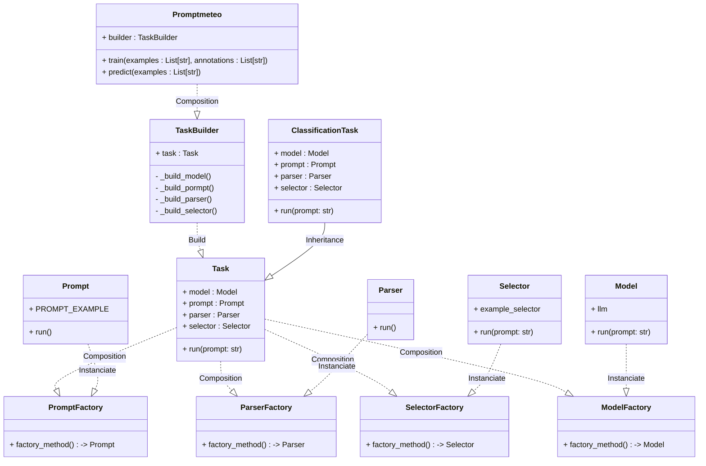

# PromptMeteo

**Promptmeteo** is a Python library build over LangChain to build prompts and LLMs by configuration parameters. The goal of this project is to be used as a template to industrialize LLM projects.

<div align="center">
<h1>🔥🧔</h1>
<i>Dammed to chains for bringing humans the light</i>

</div>


## Installation

```sh
~/promptmeteo$ make setup
```

## Quick start

```python
from promptmeteo import Promptmeteo

model = Promptmeteo(
        task_type           = 'classification',
        model_provider_name = 'hf_pipeline',
        model_name          = 'google/flan-t5-small',
        selector_algorithm  = 'semantic_similarity',
        selector_k          = 3
    )

model = model.train(
    examples = ['estoy feliz', 'me da igual', 'no me gusta'],
    annotations = ['positivo', 'neutral', 'negativo'],
)

model.predict(['que guay!!'])
```
```
>>> [[positive]]
```


## Build project

Build image and run container

```sh
$ docker build -t promptmeteo .
$ docker run -it promptmeteo bash
```

Run example

```sh
$ python examples/getting_started.py --data_path data/classification_data.csv --prompt_path prompts/classification.yml
```

Run test

```sh
$ python -m pytest tests
```

## Project Structure

```
promptmeteo
├── data
│   └── classification_data.csv
├── Dockerfile
├── examples
│   └── getting_started.py
├── LICENSE
├── Makefile
├── prompts
│   ├── classification.yml
│   └── ner_prompt.yml
├── pyproject.toml
├── README.md
├── requirements.txt
├── src
│   └── promptmeteo
│       ├── __init__.py
│       ├── main.py
│       ├── models
│       │   ├── base.py
│       │   ├── fake_llm.py
│       │   ├── hf_hub_api.py
│       │   ├── hf_pipeline.py
│       │   ├── __init__.py
│       │   └── openai.py
│       ├── parsers
│       │   ├── classification_parser.py
│       │   ├── dummy_parser.py
│       │   └── __init__.py
│       ├── prompts
│       │   ├── base.py
│       │   ├── classification_prompt.py
│       │   ├── __init__.py
│       │   ├── ner_prompt.py
│       │   └── templates
│       │       ├── en
│       │       ├── __init__.py
│       │       └── sp
│       │           ├── classification_prompt.yml
│       │           ├── __init__.py
│       │           └── ner_prompt.yml
│       ├── selector
│       │   ├── __init__.py
│       │   ├── length_selector.py
│       │   ├── marginal_relevance_selector.py
│       │   ├── n_gram_selector.py
│       │   └── semantic_similarity_selector.py
│       └── tasks
│           ├── base.py
│           ├── classification_task.py
│           ├── __init__.py
│           └── ner_task.py
└── tests
    ├── test_main.py
    ├── test_models.py
    ├── test_parsers.py
    ├── test_prompts.py
    ├── test_selectors.py
    └── test_task.py
```

## Objects


