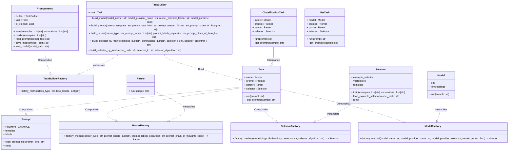

[](https://codecov.io/gh/DelgadoPanadero/PromptMeteo)

# PromptMeteo 🔥🧔

**Promptmeteo** is a Python library build over LangChain to build prompts and LLMs by configuration parameters. The goal of this project is to be used as a template to industrialize LLM projects.


# ⚡ Quick start

```python
from promptmeteo import Promptmeteo

model = Promptmeteo(
        task_type           = 'classification',
        model_provider_name = 'hf_pipeline',
        model_name          = 'google/flan-t5-small'
    )

model = model.train(
    examples = ['estoy feliz', 'me da igual', 'no me gusta'],
    annotations = ['positivo', 'neutral', 'negativo'],
)

model.predict(['que guay!!'])
```

```shell
[['positive']]
```

&nbsp;

# 🤔 What is this for?

**TL;DR**: Industrialize projects powered by LLMs easily.

LLMs are fine, but they are difficult to industrialize in real world problems because two main reasons:

 - **Prompt Versioning**: In LLMs, prompts are not just static files as configuration data, but also they has logic that defines the results of the project. Code versioning is made through git, however, there is no standard to version prompts.

- **Model Trazability**: MLOps are used to program ML pipelines and ensure the model trazability along the pipeline. However LLMs do not usually has the same logic

&nbsp;

# 🚀 How is it made?

For solving the previous problems **Prompmeteo** has the following features.

#### ⚙️ MLOps Interface

Defining a interface with independant methods for training and predicting as well as saving and loading the model, allows Promptmeteo to be trained in and independant pipeline from predicting. This allows to reuse the conventional ML pipeline for LLM projects. 

#### 📦 Model Artifacts

LLMs proyects usually require of a Vector Data Base to save and load embeddings. Prompmeteo uses FAISS as a vectorstore database that not only allow it to run Promptmeteo locally, but it also allow to store the vectordatabase as a binary file. This binary file is analogue as a model artifact in a conventional ML project.

#### 📄 Prompt Formating

Defining a concrete format when creating the prompt text, does not only allow to use it easily in a programatic way, but it also allows to versionate the prompts, understand where is the change when something happends and also **define code test oriented to prompt testing**

```yml
TEMPLATE:
    "
    Your task is to classify a text in categories:
    {__LABELS__}
    {__TASK_INFO__}
    {__ANSWER_FORMAT__}
    {__CHAIN_OF_THOUGHTS__}
    "

LABELS:
    ["positive", "negative", "neutral"]

TASK_INFO:
    "The text is a sentence written by a human and you have to classify
    it in according to its sentiment."

ANSWER_FORMAT:
    "Your answer must include the name of the category in a unique word
    in lower case and without puntuation."

CHAIN_OF_THOUGHTS:
    "Please explain your answer step by step before saying the name of
    the category"
```

# 🧩 Project Components

